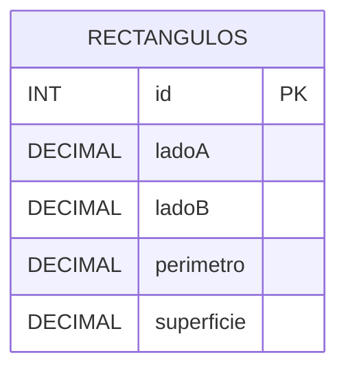

# Diagrama entidad-relación — Rectángulos

El modelo consta de una única entidad llamada **RECTANGULOS**, por lo que no existen relaciones entre tablas.

`id` es un número entero (`INT`) que identifica de forma única cada rectángulo. Es la clave primaria (`PRIMARY KEY`) y se genera automáticamente mediante `AUTO_INCREMENT`.

`ladoA` es un valor decimal (`DECIMAL(10,2)`) que representa la longitud del primer lado del rectángulo. Es obligatorio (`NOT NULL`).

`ladoB` es un valor decimal (`DECIMAL(10,2)`) que representa la longitud del segundo lado del rectángulo. Es obligatorio (`NOT NULL`).

`perimetro` es un valor decimal (`DECIMAL(10,2)`) que almacena el perímetro calculado del rectángulo. Es obligatorio (`NOT NULL`).

`superficie` es un valor decimal (`DECIMAL(10,2)`) que almacena la superficie calculada del rectángulo. Es obligatorio (`NOT NULL`).

El perímetro se obtiene mediante la fórmula **P = 2 × (ladoA + ladoB)**, mientras que la superficie se obtiene mediante **S = ladoA × ladoB**.
