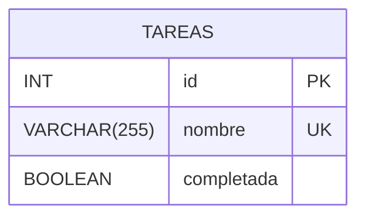

# Diagrama entidad-relación — Tareas

El modelo consta de una única entidad llamada **TAREAS**, por lo que no existen relaciones entre tablas.

`id` es un número entero (`INT`) que identifica de forma única cada tarea. Es la clave primaria (`PRIMARY KEY`) y se genera automáticamente mediante `AUTO_INCREMENT`.

`nombre` es un campo de tipo `VARCHAR(255)`, obligatorio (`NOT NULL`) y posee una restricción de unicidad (`UNIQUE KEY uk_tareas_nombre`), por lo que no pueden existir dos tareas con el mismo nombre. Utiliza la codificación `utf8mb4` y la colación `utf8mb4_es_0900_ai_ci`.

`completada` es de tipo `BOOLEAN`, obligatorio (`NOT NULL`) y tiene como valor predeterminado `FALSE`. En MySQL, `BOOLEAN` es un alias de `TINYINT(1)`, por lo que internamente se almacena como `1` o `0`. La API puede devolver estos valores como `true` o `false`.
