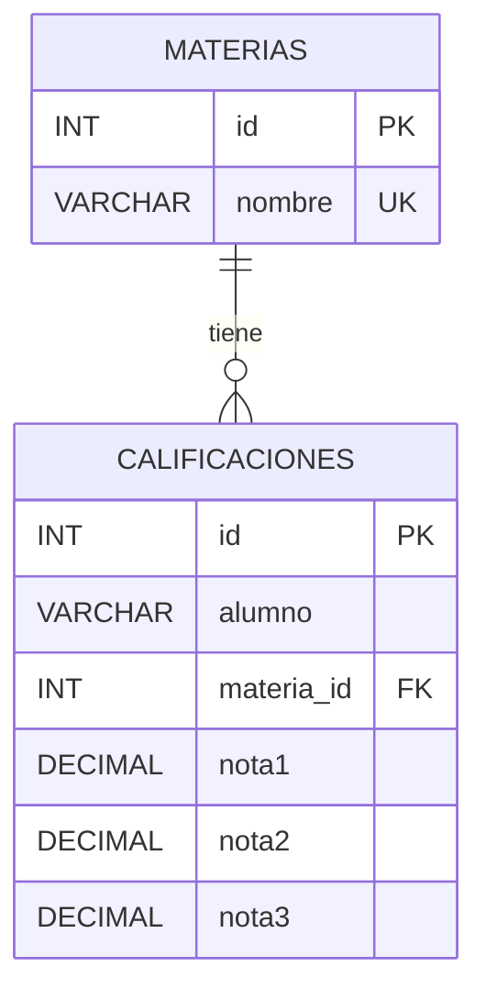

# Diagrama entidad-relación — Ejercicio 3

## Relación

Una **materia** puede tener varias calificaciones, mientras que cada **calificación** pertenece a una sola materia.

La relación se realiza mediante la clave foránea `calificaciones.materia_id`, que apunta al campo `materias.id`.

* `ON DELETE RESTRICT`: no permite eliminar una materia si tiene calificaciones asociadas.
* `ON UPDATE CASCADE`: si se modifica el `id` de una materia, el cambio se actualiza también en las calificaciones relacionadas.

## Restricciones

* `materias.id` es la clave primaria de la tabla `materias`.
* `calificaciones.id` es la clave primaria de la tabla `calificaciones`.
* `materias.nombre` no puede repetirse.
* La combinación de `alumno` y `materia_id` es única. Esto evita que un mismo alumno tenga más de una calificación para la misma materia.
* `nota1`, `nota2` y `nota3` son valores `DECIMAL(4,2)`.
* Las tres notas deben estar entre `0` y `10`.
* Todos los campos son obligatorios mediante `NOT NULL`.
* `calificaciones.materia_id` es una clave foránea que referencia a `materias.id`.

## Tablas

### MATERIAS

| Campo  | Tipo         | Restricción        |
| ------ | ------------ | ------------------ |
| id     | INT          | PK, AUTO_INCREMENT |
| nombre | VARCHAR(100) | NOT NULL, UNIQUE   |

### CALIFICACIONES

| Campo      | Tipo         | Restricción          |
| ---------- | ------------ | -------------------- |
| id         | INT          | PK, AUTO_INCREMENT   |
| alumno     | VARCHAR(100) | NOT NULL             |
| materia_id | INT          | NOT NULL, FK         |
| nota1      | DECIMAL(4,2) | NOT NULL, CHECK 0-10 |
| nota2      | DECIMAL(4,2) | NOT NULL, CHECK 0-10 |
| nota3      | DECIMAL(4,2) | NOT NULL, CHECK 0-10 |

## Claves

* **PK:** `materias.id`
* **PK:** `calificaciones.id`
* **FK:** `calificaciones.materia_id` → `materias.id`
* **UNIQUE:** `materias.nombre`
* **UNIQUE compuesto:** `(calificaciones.alumno, calificaciones.materia_id)`
